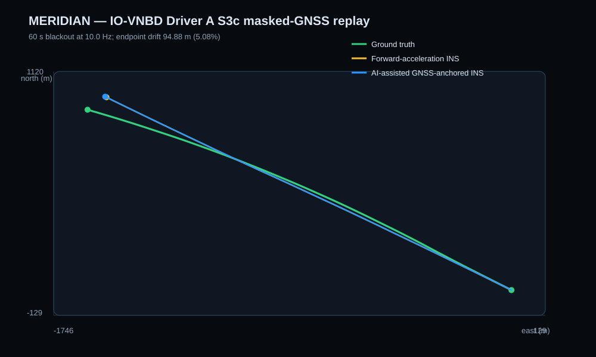
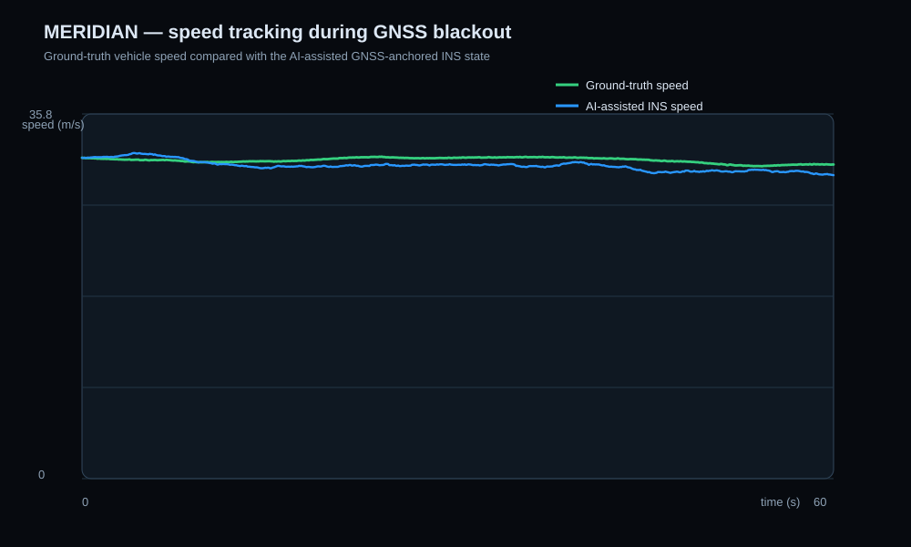
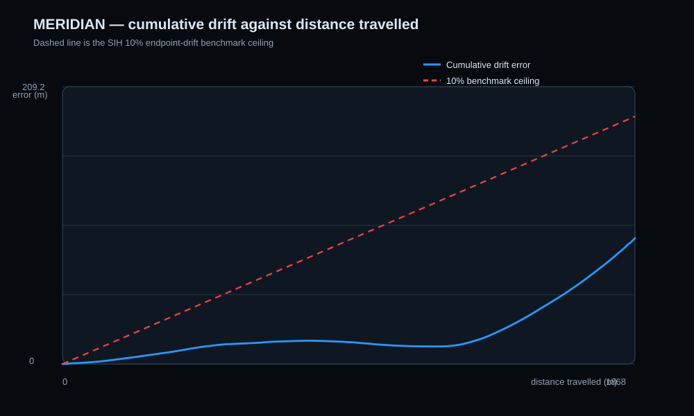
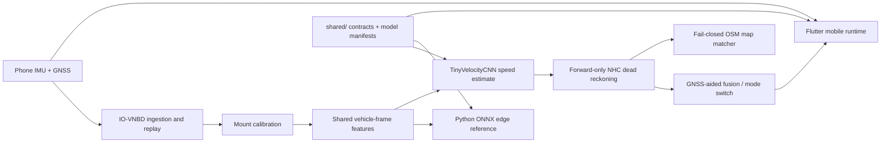

# MERIDIAN

Intelligent dead reckoning for GPS-denied road navigation on a phone and a portable edge runtime.

## Problem Statement

MERIDIAN addresses Smart India Hackathon problem statement **26168**: “AI-ML based Intelligent Dead Reckoning system for seamless navigation,” under the Indian Space Research Organisation (ISRO), Department of Space. It is a Software-category problem in the Smart Vehicles theme. The task is to keep a road vehicle navigable when GNSS becomes unavailable by combining phone IMU data with GNSS when it is available. The solution must estimate motion without OBD-II, constrain the result to how a car can move, and support both mobile and edge deployment.

## What we built

MERIDIAN is a reproducible IMU/GNSS replay and deployment pipeline. It synchronizes phone and vehicle records, learns a bounded velocity prior from gravity-compensated vehicle-frame IMU windows, anchors the live speed state to GNSS, and exposes the same model contract to a Flutter app and an ONNX Runtime edge reference. The mobile app includes a navigation view, GNSS outage simulator, Developer Mode telemetry, confidence reporting, and a real-drive recorder.

## Core features

| Problem-statement feature | Implementation and current boundary |
| --- | --- |
| In-vehicle mount calibration | Gravity-vector leveling estimates pitch/roll; turn kinematics and reliable GNSS course resolve mount yaw. Offline validation is complete; fixed-mount road validation remains pending. |
| AI speed and vibration filtering from IMU alone | A 961-parameter TinyVelocityCNN uses 2-second, 9-channel vehicle-frame IMU windows. Its output is structurally bounded to 0–45 m/s and is used only as a rate-limited change-of-velocity residual inside a GNSS-anchored inertial state; no OBD-II input is used. |
| Map matching with non-holonomic constraints | Forward-only NHC integration is implemented. A fail-closed OSM HMM/Viterbi matcher is validated offline; it is not yet wired into the mobile or edge runtime. |
| GNSS + INS fusion | The live runtime keeps Flutter's best-for-navigation Android stream as the primary source, accepts valid degraded navigation fixes separately from tighter aiding fixes, and anchors INS speed to measured GNSS before a blackout. A live EKF/UKF measurement-update implementation is still pending. |
| Seamless GNSS-loss/reacquisition switching | Mobile transitions between GNSS-aided, DR, and a 500 ms reacquisition blend, requiring a fresh post-loss fix before recovery. Physical moving-drive latency measurement is pending. |
| Real-time navigation UI | Flutter/Dart MERIDIAN provides the required splash, map, route controls, GPS-lost state, Developer Mode, and More screens. |
| Edge-deployable engine | The shared model exports to TFLite and ONNX. The Python ONNX Runtime reference accepts 100/200 Hz streams; the C++ project is an integration seam, not yet a full edge navigation engine. |

## Beyond the problem statement

- Every live velocity prediction has a continuous confidence value and an explanatory reason, rather than only a calibrated/not-calibrated flag.
- Mount degradation, shock/bumps, stale sensors, implausible model windows, weak GNSS, and unarmed vehicle motion fail closed instead of being clipped into plausible-looking motion.
- Developer Mode shows real sensor axes, raw physical GNSS, accepted/predicted positions, drift/error fields, confidence, and a trip recorder for field validation.
- The replay pipeline guards against timestamp alignment mistakes, source gaps, calibration leakage, mixed model artifacts, and overlapping train/test windows.
- Negative-motion collection and preparation tooling exists for parked/idle, bump, handheld-shake, and mount-shift captures. Those examples have **not** yet been collected across devices or used to retrain the model.
- The current runtime-equivalent model is trained from quality-audited IO-VNBD Driver A recordings plus one separate STRIDE phone-domain session. The held-out Driver A S3c benchmark below evaluates that same deployable ONNX model.

## Held-out benchmark results

The tracked Stage 12 replay masks GNSS for 59.9 seconds in the recording-disjoint IO-VNBD Driver A S3c evaluation drive. It uses the current `runtime_equivalent_kinematic_vehicle_frame_v2` feature contract, pre-outage-only mount calibration (first 300 seconds), the last GNSS-aided speed/course at loss, and no ground-truth labels in the blackout model input or inertial propagation.

| Method | Distance | Endpoint error | Drift | Update rate |
| --- | ---: | ---: | ---: | ---: |
| Forward-acceleration INS | 1,867.62 m | 96.34 m | 5.16% | 10 Hz |
| AI-assisted GNSS-anchored INS | 1,867.62 m | 94.88 m | **5.08%** | 10 Hz |

The 5.08% result is strictly below the SIH `<10%` offline drift threshold. Its [position trajectory](docs/benchmarks/iovnbd-driver-a-s3c-stage12/position_plot.svg), [speed tracking plot](docs/benchmarks/iovnbd-driver-a-s3c-stage12/speed_tracking_plot.svg), [drift-versus-distance plot](docs/benchmarks/iovnbd-driver-a-s3c-stage12/drift_vs_distance_plot.svg), [metrics](docs/benchmarks/iovnbd-driver-a-s3c-stage12/metrics.csv), and [trajectory](docs/benchmarks/iovnbd-driver-a-s3c-stage12/trajectory.csv) are tracked together with reproducibility instructions in [the benchmark deliverable](docs/benchmarks/README.md). See [the v2 training record](docs/model-training-v2.md) for the deployed artifact's data, bounds, and recording-disjoint raw-prior result. A fixed-mount real-car blackout, mobile update-rate measurement, and physical transition-latency measurement are still required; no offline result should be treated as a road-use claim.







See [detailed test results](docs/test-results.md), [the technical approach](docs/technical-approach.md), and [the compliance matrix](docs/compliance-matrix.md).

## Interface renders

Clean presentation renders for active navigation, GNSS blackout handling, and Developer Mode are available in [`docs/screenshots/`](docs/screenshots/README.md). They illustrate the interface only; the measured navigation evidence is in [the benchmark deliverable](docs/benchmarks/README.md).

## Architecture



## Tech stack

- Flutter/Dart: `sensors_plus`, `geolocator`, `flutter_map`, `provider`, and `tflite_flutter`.
- Python: NumPy, pandas, PyTorch, ONNX, ONNX Runtime, and optional matplotlib/scikit-learn tooling.
- Models: PyTorch training; TFLite for mobile and ONNX for the portable edge reference.
- Maps: OpenStreetMap road geometry for the offline safe matcher and OpenStreetMap raster tiles in the mobile view.
- Contracts: JSON feature specification, telemetry schema, and hash-bound model manifests under `shared/`.

## Datasets and map data

- [IO-VNBD](https://github.com/onyekpeu/IO-VNBD) — public phone/vehicle records used for timestamp synchronization, mount calibration, velocity training, and the tracked Driver A S3c replay. Raw data is downloaded locally and is not committed.
- [STRIDE](https://doi.org/10.6084/m9.figshare.25460755.v4) — CC BY 4.0 smartphone road-safety recordings used as secondary training-domain supervision for the v2 velocity model. Raw data is downloaded locally and is not committed.
- [OpenStreetMap](https://www.openstreetmap.org/copyright) — road-map source used by the offline matcher and mobile map tiles. The app must retain visible OpenStreetMap attribution in public/demo builds.

See [third-party notices](docs/third-party-notices.md) for upstream data, map, and dependency attribution boundaries.

## Repository structure

```text
MERIDIAN/
├── mobile/              Flutter app, live sensor bridge, TFLite inference, UI tests
├── ml/                  IO-VNBD ingestion, training, replay, exports, evaluation
├── edge/                Python ONNX Runtime reference and C++ integration seam
├── shared/              Feature contract, telemetry/model schemas, portable models
├── docs/
│   ├── benchmarks/      Tracked IO-VNBD position plot, metrics, trajectory
│   ├── design/          UI design reference material
│   ├── validation/      Real-world drive protocol
│   ├── safety/          Map-matching safety policy
│   └── screenshots/     Reviewed, non-sensitive demo captures only
├── README.md
├── LICENSE
└── .gitignore
```

## Setup and running

### Flutter mobile app

```powershell
cd mobile
flutter pub get
flutter analyze
flutter test
flutter run
```

Grant location permission on first run. A fixed phone mount and an initial quality GNSS period are required before the app can trust dead-reckoning velocity.

### ML training and evaluation

From the repository root, use Python 3.10 or later:

```powershell
python -m venv .venv
.\.venv\Scripts\Activate.ps1
python -m pip install --upgrade pip
python -m pip install -r ml/requirements.txt
$env:PYTHONPATH = "$PWD\ml\src;$PWD\edge\python\src"
python ml/scripts/fetch_iovnbd_subset.py --recording driver-a-s3c
python ml/scripts/stage3_calibrate.py --smartphone ml/data/raw/iovnbd_m/S-M.csv --vehicle ml/data/raw/iovnbd_m/V-M.csv --max-rows 5000 --calibration-end-seconds 430
python ml/scripts/stage5_train_robust_velocity.py --epochs 20
python ml/scripts/stage10_export.py --artifact-dir ml/artifacts/velocity_cnn_robust --training-metrics ml/reports/stage5_robust/metrics.json
$env:PYTHONPATH = "ml/src;edge/python/src"
py -3.13 ml/scripts/stage12_evaluate.py
```

Stage 12 evaluates the current deployable ONNX model and writes all submission artifacts to `docs/benchmarks/iovnbd-driver-a-s3c-stage12/`. See [the benchmark instructions](docs/benchmarks/README.md) for the exact data location and acceptance criteria.

### Edge reference runtime

```powershell
python -m pip install -e edge/python
$env:PYTHONPATH = "$PWD\edge\python\src"
python -m unittest discover -s edge/python/tests -v
```

The edge runtime is a velocity-inference reference. See [edge/README.md](edge/README.md) for its input contract and current integration boundary.

## Team

```text
Team: MERIDIAN

- Keshav — mobile application and runtime engineering
- Aryan6600 and Saanvi-Tayal — AI/ML pipeline
- crazysoulyt123 — UI/UX
- its-anshika-sharma — research and business
- ridhijain001 — presentation and other non-code deliverables
```

## License

This repository is licensed under the [MIT License](LICENSE).

## Submission checks still owned by the team

Before submission, verify the current SIH portal requirements for repository-link format, proposal/PPT and demo-video links, required disclosures, and any rules about how a demo video or narration must be produced. Add only reviewed, non-sensitive screenshots and field logs to the repository.
