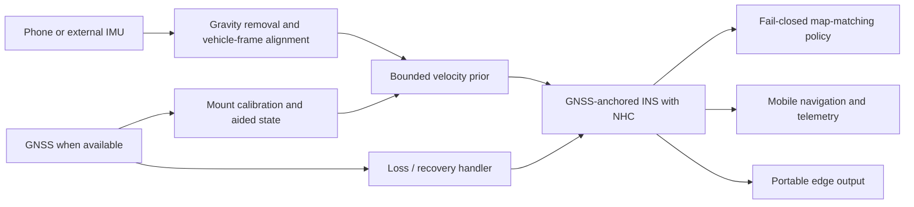

# MERIDIAN: System Architecture & Requirements Specification

## Purpose

MERIDIAN is an Intelligent Dead Reckoning (IDR) system for SIH Problem Statement 26168, sponsored by the Indian Space Research Organisation. It maintains vehicle navigation when GNSS is obstructed in tunnels, underpasses, parking structures, dense urban corridors, and other GNSS-denied environments.

The system combines a smartphone's inertial sensors with GNSS when available, without an OBD-II or wheel-speed connection. A common feature and model contract supports both the mobile application and an edge-deployable software engine for external IMUs.

## System boundaries

| Component | Responsibility | Current implementation boundary |
| --- | --- | --- |
| Flutter mobile application | Collects IMU/GNSS data, runs local inference, manages GNSS-loss states, and displays navigation/telemetry. | 10 Hz runtime; real fixed-mount validation remains pending. |
| Shared feature contract | Defines gravity-compensated vehicle-frame IMU features, model normalization, telemetry, and portable model manifests. | Version `0.2.0`; used by mobile, training, and edge reference. |
| Offline training and evaluation | Synchronizes IO-VNBD data, calibrates mounts, trains the velocity prior, exports models, and produces reproducible benchmark evidence. | Uses the held-out Driver A S3c Stage 12 replay. |
| Edge reference | Validates and resamples external IMU input before ONNX inference. | Velocity reference is available; a complete high-rate navigation stack remains future integration work. |
| Offline map matcher | Applies road geometry and non-holonomic constraints through a fail-closed HMM/Viterbi policy. | Validated offline; not yet connected to the live mobile/edge path. |

## Signal-processing and navigation flow

## Functional requirements

1. Determine phone pitch, roll, and yaw relative to the vehicle from gravity and reliable vehicle kinematics.
2. Remove gravity, reject implausible or high-vibration motion, and estimate bounded forward speed from smartphone IMU windows.
3. Maintain a non-holonomic inertial state: forward velocity is integrated while lateral and vertical vehicle velocity remain zero.
4. Accept GNSS aiding when quality is sufficient; transition immediately to dead reckoning on loss and blend safely after reacquisition.
5. Use road-network constraints only when a map-match candidate passes distance, ambiguity, and heading safety gates.
6. Support a 10 Hz mobile update loop and a portable external-IMU inference path suitable for higher-rate inputs.
7. Produce an IO-VNBD position trajectory, speed tracking plot, drift-versus-distance plot, and machine-readable metrics for review.

## Safety and validation rules

- The velocity prior is structurally limited to 0–45 m/s and may adjust only the rate of change of a GNSS-anchored speed state; it never resets speed to its absolute prediction.
- Stale, out-of-order, low-confidence, or implausible GNSS measurements are rejected or treated as availability heartbeats without rewinding the navigation state.
- A map match is optional and fail-closed: rejected candidates leave the raw inertial position intact.
- Offline replay must use pre-outage calibration only and mask all reference labels during propagation.
- The SIH offline acceptance ceiling is endpoint drift below 10% of total distance travelled during a simulated GNSS outage.

## Evidence and remaining validation

The current deployable model's held-out IO-VNBD Driver A S3c replay records 94.88 m endpoint error over 1,867.62 m (5.08% drift) at 10 Hz. See [`docs/benchmarks/README.md`](../benchmarks/README.md) for source data setup, plots, metrics, and reproducibility instructions.

Offline evidence does not replace a mounted vehicle drive. Before operational use, validate cross-device mount alignment, GNSS-loss/recovery timing, mobile update rate, and drift over real 10/30/60 second outages using the Developer Mode recorder and the field protocol.
