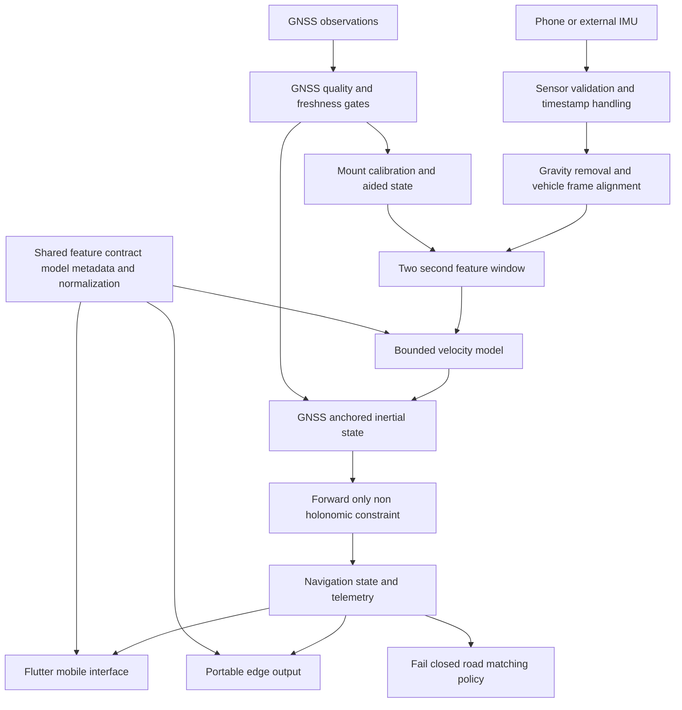

# MERIDIAN System Architecture

## Architecture overview

MERIDIAN separates model development from on-device execution. Training, calibration replay, export, and evaluation run on a desktop environment. The Android application and external-IMU edge reference use portable artifacts that share one feature contract, normalizer, and model manifest.



## Components

| Layer | Responsibility | Implementation |
| --- | --- | --- |
| Sensor input | Reads accelerometer, gyroscope, magnetometer, and GNSS observations. Rejects stale, out-of-order, malformed, or implausible input. | Android sensor and GNSS streams; Python `TelemetryFrame` for edge input |
| Mount calibration | Aligns phone axes with vehicle forward, right, and down axes using gravity and turn kinematics. | Python calibration pipeline and Flutter IMU preprocessor |
| Shared features | Defines the two-second 9-channel tensor, normalizer, model metadata, and telemetry schema. | `shared/config/feature_spec.json` and adjacent schemas/manifests |
| Velocity estimation | Produces a physically bounded forward-speed prior from calibrated IMU windows. | TinyVelocityCNN exported to TFLite and ONNX |
| Navigation state | Anchors speed and heading to recent good GNSS, propagates through GNSS loss, and applies vehicle constraints. | Flutter runtime and Python replay/fusion modules |
| Map constraint | Scores road candidates and accepts a match only if distance, ambiguity, and heading checks pass. | Offline HMM/Viterbi implementation |
| User and evaluator interface | Shows navigation status, telemetry, confidence, raw/reference positions, outage controls, and trip recorder. | Flutter application Developer Mode |
| Edge reference | Validates 100 Hz or 200 Hz external-IMU input and runs the ONNX velocity model. | Python ONNX Runtime reference |

## Feature contract

The portable model receives 20 samples over two seconds at 10 Hz. Each sample contains nine calibrated values in vehicle coordinates:

```text
linear acceleration forward right down
gyroscope forward right down
normalized magnetic direction forward right down
```

The contract version, channel order, normalization values, tensor dimensions, and artifact hashes are shared by the training pipeline, mobile TFLite loader, and edge ONNX runtime. A model manifest check prevents mixed model and normalization files from being used together.

## Navigation state flow

1. The runtime accepts current GNSS observations for navigation availability and reserves tighter-quality fixes for calibration and inertial aiding.
2. Gravity compensation and vehicle-frame alignment process each IMU sample. Motion gates can reject a window before model use.
3. After a complete two-second window, the velocity model supplies a 0 to 45 m/s prior. The navigation state never resets its speed directly from that value.
4. During a GNSS outage, the state integrates forward acceleration and calibrated yaw while enforcing zero lateral and vertical vehicle velocity.
5. The learned value can make only a bounded rate correction. This prevents a persistent model error from forcing the navigation speed to an arbitrary absolute value.
6. On GNSS recovery, the runtime requires a fresh quality fix and blends the position over 500 ms to avoid a visible jump.

## Mobile and edge boundaries

The mobile path targets a configured 10 Hz update loop and runs the TFLite model on the phone. The edge reference accepts higher-rate external IMU streams and resamples them into the same 10 Hz model window. The Python ONNX Runtime reference is verified for velocity inference; it is not a finished 200 Hz FOG navigation stack. The C++ directory is an integration interface seam rather than a compiled edge navigation engine.

## Safety and integrity controls

- The learned output is structurally constrained to 0 through 45 m/s.
- GNSS timestamp rollback, implausible jumps, stale sensor data, shock intervals, weak mount evidence, and unsuitable motion can suppress inertial updates.
- Road snapping is optional and fail closed. An unsafe candidate leaves the raw inertial coordinate unchanged.
- Calibration and evaluation are separated in the held-out replay. Calibration samples end before the simulated outage.
- Model artifacts carry hashes and provenance so the evaluator can verify that the tested ONNX binary is the deployed artifact.

For implementation-level detail, see the [architecture specification](../architecture/ARCHITECTURE.md) and [technical approach](../technical-approach.md).
